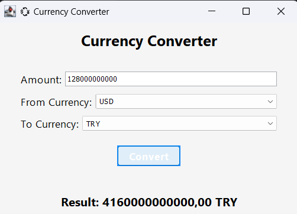

# 💱 Java Currency Converter

A simple desktop currency converter built with **Java Swing** and **org.json** library.  
This project uses **mock (fake)** exchange rate data in JSON format to simulate currency conversion.

---

## 📌 Features

- Convert between 5 currencies: **USD, EUR, TRY, GBP, JPY**
- Built-in conversion logic using fake exchange rates (JSON)
- GUI created using Java Swing
- No internet connection or real-time API required

## 🧪 Technologies Used

- Java (JDK 17+ recommended)
- Java Swing (for GUI)
- [org.json](https://github.com/stleary/JSON-java) (for JSON parsing)

## 🖼️ Screenshots

  ## License

[MIT](https://choosealicense.com/licenses/mit/)
